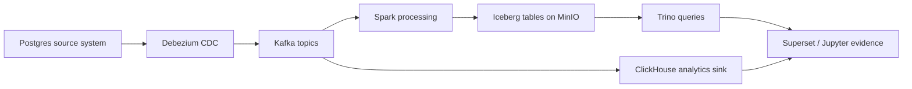

# Data Forge: портфельный case study

## Статус

Этот репозиторий — fork, который используется как портфельная лаборатория по современным Data Engineering workflows. Базовый стек взят из upstream-проекта; в этом fork он превращается в воспроизводимый applied case study с явным описанием моего вклада, validation queries и run evidence.

## Целевой сценарий

**Retail CDC to lakehouse and analytics.**

Applied case моделирует небольшую retail-систему: операционные изменения захватываются из Postgres, проходят через Kafka/Debezium, приземляются в lakehouse-хранилище и доступны для аналитических запросов.

## My Contribution in This Fork / Мой вклад в этом fork

- Добавил retail CDC/lakehouse runbook: [docs/retail-cdc-runbook.md](docs/retail-cdc-runbook.md).
- Добавил validation SQL для source system: [sql/validation/postgres_retail_seed_checks.sql](sql/validation/postgres_retail_seed_checks.sql).
- Добавил Kafka validation checklist: [sql/validation/kafka_topic_inventory.md](sql/validation/kafka_topic_inventory.md).
- Добавил аналитические SQL-примеры для Postgres, ClickHouse и Trino в [sql/examples/](sql/examples/).
- Добавил evidence capture contract в [docs/assets/](docs/assets/).
- Добавил ClickHouse Kafka ingestion contract с source tables, materialized views и CI-backed validation: [sql/validation/clickhouse_ingestion_contract.md](sql/validation/clickhouse_ingestion_contract.md).
- Добавил сгенерированный static evidence bundle: [docs/evidence/retail-cdc-evidence.md](docs/evidence/retail-cdc-evidence.md).
- Оставил README честным: явно указал происхождение fork и текущие ограничения.

## Validation Contract / Контракт валидации

В case study сейчас несколько слоёв проверки:

| Layer | Evidence | File |
| --- | --- | --- |
| Source data | seed counts, duplicate keys, FK sanity, inventory sanity | `sql/validation/postgres_retail_seed_checks.sql` |
| Streaming | generator topics, CDC topics, sample records, schema subjects | `sql/validation/kafka_topic_inventory.md` |
| Analytics | retail profile, realtime sales, lakehouse quality examples | `sql/examples/` |
| Runtime contract | Compose env names, generator config, DAG topics, Debezium/Postgres CDC tables, ClickHouse sink tables | `scripts/validate_runtime_contract.py` |
| ClickHouse ingestion | Kafka Engine tables, consumer groups, materialized views into analytics tables | `infra/clickhouse/init/002_kafka_event_ingestion.sql` |
| Static evidence bundle | сгенерированная сводка по topics/tables/validation для reviewer-friendly проверки | `docs/evidence/retail-cdc-evidence.md` |

## Acceptance criteria

- Reviewer может запустить один локальный сценарий через Docker Compose по [docs/retail-cdc-runbook.md](docs/retail-cdc-runbook.md).
- Case study объясняет, что изменено в этом fork относительно upstream.
- В репозитории есть validation SQL/checklists для ingestion, аналитических запросов и data quality checks.
- Проект называется learning lab до тех пор, пока live run evidence не будет зафиксирован в репозитории.

## Ближайший backlog

1. Запустить полный стек и сохранить screenshots/logs в `docs/assets/`.
2. Добавить Kafka-to-lakehouse ingestion jobs для raw bronze events.
3. Добавить лёгкий smoke profile для Kafka, Schema Registry, ClickHouse и generator.
4. Перевести репозиторий из `lab` в `applied case study` только после коммита live run evidence.
