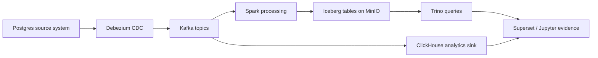

# Data Forge Portfolio Case Study

## Status

This repository is a fork used as a portfolio lab for modern Data Engineering workflows. The base stack comes from the upstream project; this fork is being converted into a reproducible applied case study with explicit contribution notes, validation queries, and run evidence.

## Target Scenario

**Retail CDC to lakehouse and analytics.**

The applied case will model a small retail system where operational changes are captured from Postgres, streamed through Kafka/Debezium, landed into lakehouse storage, and queried through analytical engines.

## My Contribution in This Fork

- Added a retail CDC/lakehouse runbook: [docs/retail-cdc-runbook.md](docs/retail-cdc-runbook.md).
- Added source-system validation SQL: [sql/validation/postgres_retail_seed_checks.sql](sql/validation/postgres_retail_seed_checks.sql).
- Added Kafka validation checklist: [sql/validation/kafka_topic_inventory.md](sql/validation/kafka_topic_inventory.md).
- Added analytical example queries for Postgres, ClickHouse, and Trino under [sql/examples/](sql/examples/).
- Added an evidence capture contract under [docs/assets/](docs/assets/).
- Added a ClickHouse Kafka ingestion contract with source tables, materialized views, and CI-backed validation: [sql/validation/clickhouse_ingestion_contract.md](sql/validation/clickhouse_ingestion_contract.md).
- Added a generated static evidence bundle: [docs/evidence/retail-cdc-evidence.md](docs/evidence/retail-cdc-evidence.md).
- Kept the README honest about fork origin and current limitations.

## Validation Contract

The case study now has three layers of validation:

| Layer | Evidence | File |
| --- | --- | --- |
| Source data | seed counts, duplicate keys, FK sanity, inventory sanity | `sql/validation/postgres_retail_seed_checks.sql` |
| Streaming | generator topics, CDC topics, sample records, schema subjects | `sql/validation/kafka_topic_inventory.md` |
| Analytics | retail profile, realtime sales, lakehouse quality examples | `sql/examples/` |
| Runtime contract | Compose env names, generator config, DAG topics, Debezium/Postgres CDC tables, ClickHouse sink tables | `scripts/validate_runtime_contract.py` |
| ClickHouse ingestion | Kafka Engine tables, consumer groups, materialized views into analytics tables | `infra/clickhouse/init/002_kafka_event_ingestion.sql` |
| Static evidence bundle | generated topic/table/validation summary for reviewers | `docs/evidence/retail-cdc-evidence.md` |

## Acceptance Criteria

- A reviewer can run one local scenario with Docker Compose using `docs/retail-cdc-runbook.md`.
- The case study explains what changed in this fork versus upstream.
- The repo includes validation SQL/checklists for ingestion, analytical query output, and data quality checks.
- The project is presented as a learning lab until captured run evidence is added.

## Next Backlog

1. Run the full stack and capture screenshots/logs under `docs/assets/`.
2. Add Kafka-to-lakehouse ingestion jobs for raw bronze events.
3. Add a lighter smoke profile for Kafka, Schema Registry, ClickHouse, and the generator.
4. Promote the repo from `lab` to `applied case study` only after live run evidence is committed.
