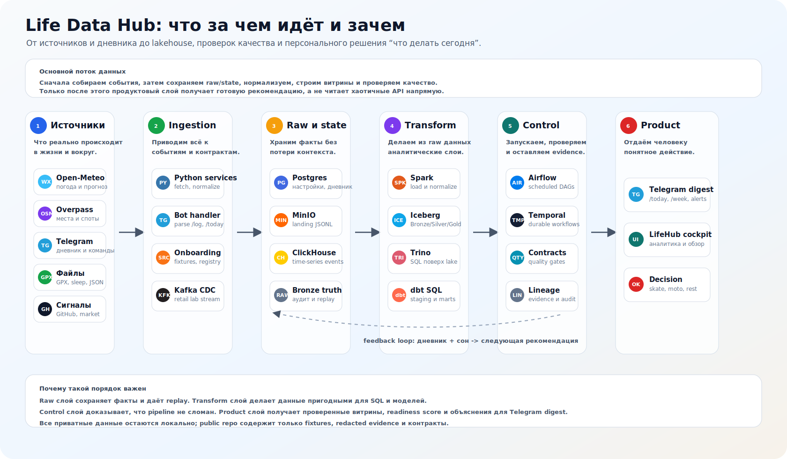

# Life Data Hub

Локальная data engineering платформа для персональных и прикладных решений: погода, спорт, восстановление, активность, сигналы из проектов и другие источники собираются в единый контур данных, проходят контракты качества и превращаются в понятные рекомендации.

Главная продуктовая идея:

> Каждый день отвечать на вопрос: что делать сегодня, если учитывать погоду в Санкт-Петербурге, места рядом, дневник тренировок, сон, усталость, цели и обратную связь?

Проект построен как реальный data-продукт, а не набор разрозненных скриптов. Данные входят через контролируемые источники, сохраняются в operational/event log, попадают в lakehouse, проверяются контрактами и становятся основой для аналитики, Telegram-дайджеста и будущих доменов.

## Схема стека



Схема показывает, как разные классы источников проходят единый путь: public APIs, Telegram diary, локальные файлы и сигналы проектов попадают в ingestion layer, затем в Postgres, ClickHouse и lakehouse, обрабатываются Spark/Trino/dbt и управляются Airflow/Temporal/DataOps проверками. На выходе остаются не сырые данные, а продуктовые поверхности: Telegram digest, cockpit, evidence и lineage.

## Что уже есть

- **LifeHub** - персональный домен для спорта, outdoor readiness и восстановления.
- **Telegram-first интерфейс** - дневник активности, `/today`, `/week`, `/spots`, ежедневный digest.
- **Санкт-Петербург по умолчанию** - погода, outdoor spots, skate/snow/moto/gym/walk сценарии.
- **Локальная приватность** - реальные токены, заметки, адреса, health/broker exports не попадают в репозиторий.
- **Lakehouse pipeline** - landing JSONL -> Spark -> Iceberg Bronze/Silver/Gold -> Trino.
- **DataOps слой** - data contracts, catalog, expectations, validators, lineage и evidence.
- **Retail CDC сценарий** - сохранен как инженерная лаборатория для Kafka/Debezium/ClickHouse/Trino.

## Продуктовая ценность

LifeHub помогает принимать маленькие ежедневные решения на основе данных:

- идти кататься на скейте или выбрать зал;
- ехать на мотозанятие или учитывать дождь, ветер и риск скользкой дороги;
- ловить подходящий день для сноуборда и зимних активностей;
- видеть недельную консистентность по тренировкам;
- учитывать сон, усталость, настроение и боль перед высокоинтенсивной активностью;
- добавлять новые источники без переписывания всей платформы.

MVP не отправляет личные данные во внешние сервисы. Публичные fixture-файлы синтетические или безопасные.

## Data Engineering стек

| Слой | Инструменты | Зачем |
| --- | --- | --- |
| Operational storage | Postgres | Локальное состояние, дневник, места, настройки, рекомендации |
| Analytical storage | ClickHouse | Time-series, витрины и быстрые продуктовые срезы |
| Object storage | MinIO | S3-compatible landing и lakehouse storage |
| Table format | Iceberg | Bronze/Silver/Gold таблицы |
| Metadata | Hive Metastore | Каталог Iceberg |
| Processing | Spark | Загрузка JSONL в lakehouse и нормализация событий |
| SQL/DWH | Trino | Запросы к Iceberg и аналитическим слоям |
| Streaming/CDC | Kafka, Schema Registry, Debezium | Инженерная лаборатория для event streaming и CDC |
| Orchestration | Airflow, Temporal | Плановые и durable workflows |
| Analytics engineering | dbt-compatible SQL | Staging и mart модели |
| DataOps | contracts, catalog, expectations, validators, evidence | Проверяемость и воспроизводимость |
| Product interface | Telegram Bot API | Первый полезный пользовательский интерфейс |

Подробная карта стека: [docs/data-engineering-stack.md](docs/data-engineering-stack.md).

## Быстрый старт

Требования:

- Docker 20.10+
- Docker Compose 2+
- Python 3.11+
- 8 GB RAM минимум, 16 GB желательно для полного lakehouse smoke
- около 20 GB свободного места для полного локального стека

```bash
git clone https://github.com/karnaksp/life-data-hub.git
cd life-data-hub
cp .env.example .env
```

Проверка проекта:

```bash
make validate
```

Локальный LifeHub profile:

```bash
docker compose --profile lifehub up -d
```

Демо без реальных токенов:

```bash
make lifehub-demo
```

Полный lakehouse smoke:

```bash
make lifehub-lakehouse-runtime-smoke
```

## Основные команды

```bash
make lifehub-tests
make lifehub-score-fixture
make lifehub-weekly-review-fixture
make lifehub-lake-export-fixture
make lifehub-lakehouse-runtime-smoke
make lifehub-source-onboard-demo
make lifehub-sleep-fixture
make lifehub-evidence-flow
make lifehub-cockpit-demo
```

## LifeHub

LifeHub - первый прикладной продукт внутри платформы.

Документация:

- [docs/lifehub.md](docs/lifehub.md) - продукт, команды, Telegram behavior, storage и source onboarding;
- [infra/lifehub/README.md](infra/lifehub/README.md) - сервисный слой;
- [config/lifehub/source_registry.yaml](config/lifehub/source_registry.yaml) - реестр источников;
- [contracts/lifehub/data_contract.yaml](contracts/lifehub/data_contract.yaml) - data contract;
- [catalog/lifehub/datasets.yaml](catalog/lifehub/datasets.yaml) - каталог датасетов;
- [expectations/lifehub/expectations.yaml](expectations/lifehub/expectations.yaml) - проверки качества.

Текущие источники MVP:

- Open-Meteo forecast fixtures/API для Санкт-Петербурга;
- OpenStreetMap/Overpass fixtures/API для sport/outdoor мест;
- Telegram diary model для ручного логирования;
- GPX/activity files;
- sleep quality как recovery source;
- context, GitHub и market signal fixtures для будущих доменов.

## Как добавить новый источник

Новые источники должны входить через общий medallion-контракт, а не через отдельные одноразовые скрипты.

Пример генерации onboarding package:

```bash
PYTHONPATH=infra/lifehub python -m lifehub.cli source-onboard sleep_quality \
  --domain recovery \
  --source-type local_json_event \
  --event-type sleep_metric \
  --required-fields occurred_at,domain,metric_name,metric_value \
  --output-dir tmp/lifehub/source_onboarding
```

Генератор создает:

- source registry entry;
- synthetic fixture;
- runbook с import и lakehouse smoke командами.

После этого источник можно продвинуть в first-class connector. Так уже сделан `sleep_quality`: он нормализуется, пишет privacy-safe landing events, попадает в Iceberg Bronze/Silver, доступен в Trino и влияет на рекомендации.

## Сервисы

| Сервис | URL | Логин по умолчанию |
| --- | --- | --- |
| Kafka UI | http://localhost:8082 | без авторизации |
| Airflow | http://localhost:8085 | `airflow` / `airflow` |
| Superset | http://localhost:8089 | `admin` / `admin` |
| MinIO Console | http://localhost:9001 | `minio` / `minio123` |
| Trino | http://localhost:8080 | без авторизации |
| Temporal Web | http://localhost:8233 | без авторизации |

Полный индекс сервисов: [docs/services.md](docs/services.md).

## Evidence

Проект хранит проверяемые evidence-файлы без приватного содержимого:

- [docs/evidence/lifehub-lakehouse-evidence.md](docs/evidence/lifehub-lakehouse-evidence.md);
- [docs/evidence/lifehub-lakehouse-runtime-evidence.md](docs/evidence/lifehub-lakehouse-runtime-evidence.md);
- [docs/evidence/lifehub-evidence.md](docs/evidence/lifehub-evidence.md);
- [docs/evidence/retail-cdc-evidence.md](docs/evidence/retail-cdc-evidence.md).

## Retail CDC сценарий

Исходный retail CDC/lakehouse сценарий сохранен как инженерная лаборатория и regression surface.

Он покрывает:

- seed-таблицы Postgres;
- Debezium CDC topics;
- Kafka и Schema Registry contracts;
- ClickHouse ingestion;
- validation SQL и evidence.

Документация:

- [CASE_STUDY.md](CASE_STUDY.md);
- [docs/retail-cdc-runbook.md](docs/retail-cdc-runbook.md);
- [sql/validation/](sql/validation/);
- [sql/examples/](sql/examples/).

## Разработка

- [docs/architecture.md](docs/architecture.md) - архитектура и Docker Compose profiles;
- [docs/development.md](docs/development.md) - локальная разработка и validation;
- [docs/troubleshooting.md](docs/troubleshooting.md) - типовые проблемы;
- [docs/guidelines.md](docs/guidelines.md) - стиль документации и изменений;
- [docs/learning-path.md](docs/learning-path.md) - учебный маршрут по стеку.

## Releases и packages

Релизы публикуются через GitHub Releases. Docker package для LifeHub service собирается в GitHub Container Registry как:

```text
ghcr.io/karnaksp/life-data-hub/lifehub
```

Публикация package запускается при создании release tag `v*`.

## Приватность

- Реальные `TELEGRAM_BOT_TOKEN`, `TELEGRAM_CHAT_ID`, дневниковые заметки, pain text, адреса, маршруты, broker exports и health exports остаются локально.
- В репозитории лежат только synthetic/demo данные и публично безопасные fixtures.
- Evidence хранит counts, статусы контрактов и redacted summaries.
- `.env.example` описывает переменные, настоящий `.env` не коммитится.

## Лицензия

MIT. См. [LICENSE](LICENSE).
