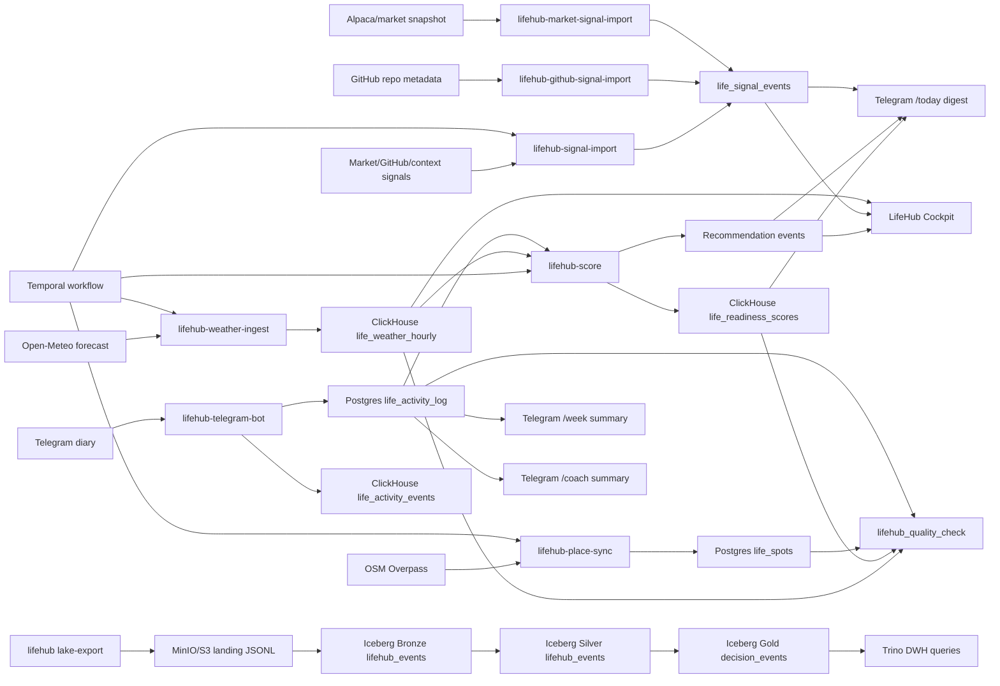

# Data Engineering Stack Map

Data Forge is intentionally a local platform repo, not a single-purpose app. The stack covers the main data engineering capabilities that are useful to practice, demo, and extend.

## Capability map

| Capability | Retail CDC domain | LifeHub domain |
| --- | --- | --- |
| Operational source | Postgres retail tables | Postgres activity diary and spots |
| Change/event capture | Debezium CDC, Kafka topics | Telegram/manual events, public API snapshots, GitHub/market context events |
| Streaming / lake ingestion | Spark Structured Streaming to Iceberg | JSONL landing export plus Spark JSONL-to-Iceberg loader |
| Data lake / lakehouse | MinIO object storage, Hive Metastore, Iceberg Bronze | `s3a://iceberg/lifehub/landing`, `iceberg.bronze.lifehub_events` |
| DWH / analytical serving | Trino over Iceberg, ClickHouse event sinks | `iceberg.silver.lifehub_events`, `iceberg.gold.lifehub_decision_events`, ClickHouse decision marts |
| Orchestration | Airflow `bronze_events_kafka_stream` | Airflow `lifehub_daily_pipeline`, `lifehub_lakehouse_pipeline`, Temporal `LifeHubDailyDecisionWorkflow` |
| Contracts | Schema Registry Avro, validation scripts | `contracts/lifehub/data_contract.yaml` |
| Data catalog | service READMEs and docs index | `catalog/lifehub/datasets.yaml` |
| Data quality | runtime contract and SQL validation | `expectations/lifehub/expectations.yaml`, `scripts/lifehub_quality_check.py`, SQL checks |
| Analytics engineering | SQL examples | `dbt/lifehub` dbt-compatible staging and marts |
| Lineage | Airflow task graph, datasets | `scripts/emit_lifehub_lineage.py` OpenLineage-compatible event |
| Evidence | redacted CDC evidence bundle | redacted LifeHub evidence bundle |
| Exploration | Jupyter, Trino, Superset | Jupyter, Trino, Superset, Telegram digest |

## Useful commands

```bash
make validate
make lifehub-demo
make lifehub-source-onboard-demo
make lifehub-lake-export-fixture
make lifehub-sleep-fixture
make lifehub-lakehouse-runtime-smoke
make lifehub-up-local
make lifehub-quality
make lifehub-lineage
make lifehub-evidence
make lifehub-temporal-up
make lifehub-temporal-start-fixture
make lifehub-cockpit
```

## LifeHub DE flow



## LifeHub lakehouse contract

LifeHub has a generic medallion intake under `config/lifehub/source_registry.yaml`.
Every new personal source should enter through the same contract:

1. normalize into a privacy-safe event envelope;
2. write JSONL landing files under `lifehub/landing/<source>/dt=<date>/events.jsonl`;
3. load the files into Iceberg Bronze with `lifehub_jsonl_to_iceberg.py`;
4. promote valid typed events to Silver;
5. publish decision-oriented aggregates/profiles to Gold.

Implemented layers:

- landing: `tmp/lake/lifehub/landing` locally, `s3a://iceberg/lifehub/landing` in object storage;
- bronze: `iceberg.bronze.lifehub_events`;
- silver: `iceberg.silver.lifehub_events`;
- gold: `iceberg.gold.lifehub_decision_events`;
- DWH access: Trino SQL in `sql/lifehub/trino_lifehub_lakehouse.sql`.

Runtime proof:

```bash
make lifehub-lakehouse-runtime-smoke
```

This target exports fixture LifeHub sources, starts the Docker lakehouse services, loads landing JSONL into Iceberg Bronze/Silver/Gold with Spark, queries the tables through Trino, and writes redacted evidence to `docs/evidence/lifehub-lakehouse-runtime-evidence.md`.

The same path works for future sources such as Strava/GPX, moto-school schedules, broker exports, sleep data, calendar events, or GitHub project telemetry. Add a source entry to the registry, create a privacy-safe normalizer, and reuse the lake export plus Spark loader.

The first concrete extension is `activity_files`: `fixtures/lifehub/activity_route_spb_public.gpx` is parsed by `lifehub.cli activity-file-import`, exported to `lifehub/landing/activity_files`, and then loaded by the same Iceberg path as other LifeHub sources.

The first first-class recovery source is `sleep_quality`: `fixtures/lifehub/sleep_quality.json` is parsed by `lifehub.cli sleep-import`, exported to `lifehub/landing/sleep_quality`, and loaded into the shared Iceberg Bronze/Silver tables. This makes recovery data available for daily decision personalization without committing raw health exports.

The generic onboarding path is `custom_life_events`: a local JSON file can be imported with `lifehub.cli custom-source-import` after its source is present in the registry. The importer removes notes, addresses, tokens and raw personal text before writing landing JSONL, so a rough new source can use the same lakehouse/DWH contract while a dedicated connector is being designed.

For a new source, start with the onboarding generator instead of hand-editing every file:

```bash
PYTHONPATH=infra/lifehub python -m lifehub.cli source-onboard sleep_quality \
  --domain recovery \
  --source-type local_json_event \
  --event-type sleep_metric \
  --required-fields occurred_at,domain,metric_name,metric_value \
  --output-dir tmp/lifehub/source_onboarding
```

It creates a registry entry, synthetic fixture and runbook. After review, rerun with `--apply-registry` or copy the snippet into `config/lifehub/source_registry.yaml`, import the generated fixture with `custom-source-import`, and prove the path with `make lifehub-lakehouse-runtime-smoke`.

## Data contract policy

The LifeHub contract separates public data from personal diary data:

- public weather and OSM places can be regenerated and committed as fixtures;
- Telegram token, chat id, diary notes, pain text, and private addresses must never be committed;
- evidence files contain counts and status only;
- personal favorite locations should be broad public areas, not home/work/garage addresses.

## What this demonstrates

- local reproducible infrastructure with Docker Compose profiles;
- object storage plus Iceberg medallion layers for LifeHub, not only app tables;
- batch-like public API ingestion;
- operational and analytical storage split;
- idempotent schema creation for long-lived local volumes;
- redacted evidence generation;
- runtime quality checks with non-zero exit on contract violations;
- catalog, expectations, dbt-compatible models, and lineage metadata as code;
- Airflow orchestration that can run the same code paths as local CLI commands;
- Temporal durable orchestration for the daily decision workflow, with retries, workflow progress and replay-safe separation between workflow code and I/O activities;
- a static local cockpit generated from analytical marts, so the platform has a privacy-safe visual decision surface in addition to Telegram.
