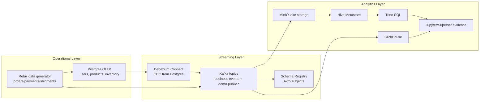

# Runbook retail CDC lakehouse

Runbook описывает локальный retail CDC контур: Postgres публикует операционные изменения, генератор пишет бизнес-события в Kafka, а SQL-клиенты проверяют аналитический слой и ClickHouse ingestion.

## Бизнес-сценарий

Retail marketplace нужна near-real-time видимость заказов, платежей, отгрузок, движения запасов и изменений справочников. Локальный stack моделирует operational system и analytical platform:

- Postgres хранит reference и inventory tables.
- Debezium захватывает изменения Postgres в Kafka CDC topics.
- Data generator публикует order, payment, shipment, inventory и customer-interaction events.
- Kafka UI, Trino, ClickHouse, Superset и JupyterLab дают operational и analytical evidence.

## Архитектура



## Локальный запуск

### 1. Настроить окружение

```bash
cp .env.example .env
```

Для laptop-friendly запуска снизьте event rate в `.env` или передайте значения inline:

```bash
TARGET_EPS=25
P_BAD_RECORD=0.01
P_LATE_EVENT=0.05
CANON_INVENTORY=postgres
```

### 2. Запустить core services

```bash
docker compose --profile core up -d
docker compose ps
```

Ожидаемые ключевые services:

| Service | Назначение | URL |
| --- | --- | --- |
| Kafka UI | проверка topics и consumers | http://localhost:8082 |
| Trino | federated SQL | http://localhost:8080 |
| MinIO | S3-compatible storage | http://localhost:9001 |
| Postgres | source database | `localhost:5432` |
| Debezium | CDC connector API | http://localhost:8083 |

### 3. Запустить retail generator

```bash
docker compose --profile datagen up -d data-generator
docker compose logs -f data-generator
```

В healthy output должны быть похожие сообщения:

```text
[fakegen] waiting for Postgres...
Seeded: 500 users, 200 products, 5 warehouses, 20 suppliers
[fakegen] waiting for Schema Registry...
[fakegen] target EPS=...
```

### 4. Проверить Kafka topics

Откройте Kafka UI на http://localhost:8082 и проверьте topics:

| Topic | Смысл |
| --- | --- |
| `orders.v1` | order events |
| `payments.v1` | payment events |
| `shipments.v1` | shipment events |
| `inventory-changes.v1` | inventory movement events |
| `customer-interactions.v1` | customer behavior events |
| `demo.public.users` | Debezium CDC для `users` |
| `demo.public.products` | Debezium CDC для `products` |
| `demo.public.inventory` | Debezium CDC для `inventory` |
| `demo.public.warehouse_inventory` | Debezium CDC для `warehouse_inventory` |

### 5. Запустить validation checks

Запустить Postgres checks:

```bash
docker compose exec -T postgres psql -U admin -d demo < sql/validation/postgres_retail_seed_checks.sql
```

Запустить Kafka topic checks из shell Kafka container:

```bash
docker compose exec kafka bash
kafka-topics.sh --bootstrap-server kafka:9092 --list
kafka-topics.sh --bootstrap-server kafka:9092 --describe --topic orders.v1
```

Используйте `sql/validation/kafka_topic_inventory.md` как checklist.

### 6. Запустить аналитические examples

Используйте SQL examples после подключения соответствующих sinks или query engines:

| File | Engine | Назначение |
| --- | --- | --- |
| `sql/examples/postgres_retail_profile.sql` | Postgres | Source-system profile и retail dimensions |
| `sql/examples/clickhouse_realtime_sales.sql` | ClickHouse | Realtime event analytics pattern |
| `sql/examples/trino_lakehouse_quality.sql` | Trino | Lakehouse bronze quality pattern |

ClickHouse example подключен через Kafka Engine source tables и materialized views в `infra/clickhouse/init/002_kafka_event_ingestion.sql`. Для короткого runtime smoke используйте команды из `sql/validation/clickhouse_ingestion_contract.md`. Trino example остается target-state lakehouse query, пока raw Bronze ingestion evidence не будет финализирован.

Для diffable ClickHouse live evidence capture выполните:

```bash
python scripts/capture_clickhouse_evidence.py --duration 60 --cleanup
```

### 7. Проверить static evidence

Сгенерируйте и проверьте Docker-free evidence bundle:

```bash
python scripts/generate_evidence_bundle.py
python scripts/validate_project.py
```

Откройте `docs/evidence/retail-cdc-evidence.md`, чтобы проверить текущие topic, table, materialized-view и validation-command contracts.

## Evidence для сохранения

Когда stack успешно запускается, сохраняйте эти screenshots или logs в `docs/assets/`:

| Evidence | File name |
| --- | --- |
| Kafka UI topic list с retail topics | `kafka-topics.png` |
| Data generator logs с seed + target EPS | `generator-logs.png` |
| Postgres validation query output | `postgres-validation.png` |
| Trino или ClickHouse analytical query output | `analytics-query.png` |
| ClickHouse table list | `clickhouse-show-tables.txt` |
| ClickHouse event counts | `clickhouse-orders-count.txt`, `clickhouse-payments-count.txt`, `clickhouse-inventory-count.txt` |

## Остановить и очистить

```bash
docker compose --profile datagen down
docker compose --profile core down
```

Чтобы удалить local data volumes:

```bash
docker compose --profile core --profile datagen down -v
```

## Известные ограничения

- Runbook описывает прикладной runtime-контур и validation contract. Он пока не доказывает, что у каждого sink есть live run evidence.
- ClickHouse ingestion contract проверяется статически; runtime proof все еще требует локальных row-count logs после генерации событий.
- Trino example query может потребовать корректировки table names после финализации lakehouse ingestion jobs.
- Проект остается local retail CDC platform, пока следующий проход не добавит original ingestion jobs и captured run evidence для всех основных sinks.
