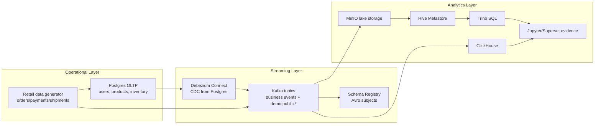

# Retail CDC Lakehouse Runbook

This runbook turns the fork into a concrete Data Engineering case study: a local retail platform emits operational changes from Postgres and business events into Kafka, then exposes validation and analytical checks through SQL clients.

## Business Scenario

A retail marketplace needs near-real-time visibility into orders, payments, shipments, inventory movement, and reference-data changes. The local stack models the operational system and the analytical platform:

- Postgres stores reference and inventory tables.
- Debezium captures Postgres changes into Kafka CDC topics.
- The data generator emits order, payment, shipment, inventory, and customer-interaction events.
- Kafka UI, Trino, ClickHouse, Superset, and JupyterLab provide operational and analytical evidence.

## Architecture



## Local Run

### 1. Configure

```bash
cp .env.example .env
```

For a laptop-friendly run, lower the event rate in `.env` or pass it inline:

```bash
TARGET_EPS=25
P_BAD_RECORD=0.01
P_LATE_EVENT=0.05
CANON_INVENTORY=postgres
```

### 2. Start Core Services

```bash
docker compose --profile core up -d
docker compose ps
```

Expected key services:

| Service | Purpose | URL |
| --- | --- | --- |
| Kafka UI | topic and consumer inspection | http://localhost:8082 |
| Trino | federated SQL | http://localhost:8080 |
| MinIO | S3-compatible storage | http://localhost:9001 |
| Postgres | source database | `localhost:5432` |
| Debezium | CDC connector API | http://localhost:8083 |

### 3. Start the Retail Generator

```bash
docker compose --profile datagen up -d data-generator
docker compose logs -f data-generator
```

Healthy output should include messages similar to:

```text
[fakegen] waiting for Postgres...
Seeded: 500 users, 200 products, 5 warehouses, 20 suppliers
[fakegen] waiting for Schema Registry...
[fakegen] target EPS=...
```

### 4. Inspect Kafka Topics

Open Kafka UI at http://localhost:8082 and check these topics:

| Topic | Meaning |
| --- | --- |
| `orders.v1` | order events |
| `payments.v1` | payment events |
| `shipments.v1` | shipment events |
| `inventory-changes.v1` | inventory movement events |
| `customer-interactions.v1` | customer behavior events |
| `demo.public.users` | Debezium CDC for `users` |
| `demo.public.products` | Debezium CDC for `products` |
| `demo.public.inventory` | Debezium CDC for `inventory` |
| `demo.public.warehouse_inventory` | Debezium CDC for `warehouse_inventory` |

### 5. Run Validation Checks

Run Postgres checks:

```bash
docker compose exec -T postgres psql -U admin -d demo < sql/validation/postgres_retail_seed_checks.sql
```

Run Kafka topic checks from a Kafka container shell:

```bash
docker compose exec kafka bash
kafka-topics.sh --bootstrap-server kafka:9092 --list
kafka-topics.sh --bootstrap-server kafka:9092 --describe --topic orders.v1
```

Use `sql/validation/kafka_topic_inventory.md` as the checklist.

### 6. Run Analytical Examples

Use the SQL examples after the corresponding sinks or query engines are wired:

| File | Engine | Purpose |
| --- | --- | --- |
| `sql/examples/postgres_retail_profile.sql` | Postgres | Source-system profile and retail dimensions |
| `sql/examples/clickhouse_realtime_sales.sql` | ClickHouse | Realtime event analytics pattern |
| `sql/examples/trino_lakehouse_quality.sql` | Trino | Lakehouse bronze quality pattern |

The ClickHouse example is wired through Kafka Engine source tables and materialized views in `infra/clickhouse/init/002_kafka_event_ingestion.sql`. Use `sql/validation/clickhouse_ingestion_contract.md` for the short runtime smoke commands. The Trino example remains a target-state lakehouse query until the raw Bronze ingestion evidence is finalized.

### 7. Review Static Evidence

Generate and inspect the Docker-free evidence bundle:

```bash
python scripts/generate_evidence_bundle.py
python scripts/validate_project.py
```

Open `docs/evidence/retail-cdc-evidence.md` to review the current topic, table, materialized-view, and validation-command contract.

## Evidence to Capture

When the stack runs successfully, capture these screenshots or logs under `docs/assets/`:

| Evidence | File name |
| --- | --- |
| Kafka UI topic list with retail topics | `kafka-topics.png` |
| Data generator logs showing seed + target EPS | `generator-logs.png` |
| Postgres validation query output | `postgres-validation.png` |
| Trino or ClickHouse analytical query output | `analytics-query.png` |
| ClickHouse table list | `clickhouse-show-tables.txt` |
| ClickHouse event counts | `clickhouse-orders-count.txt`, `clickhouse-payments-count.txt`, `clickhouse-inventory-count.txt` |

## Stop and Clean Up

```bash
docker compose --profile datagen down
docker compose --profile core down
```

To remove local data volumes:

```bash
docker compose --profile core --profile datagen down -v
```

## Known Limitations

- This runbook documents the applied case and validation contract. It does not yet prove that every sink has live run evidence.
- The ClickHouse ingestion contract is statically validated; runtime proof still requires local row-count logs after generator events are produced.
- The Trino example query may need table-name adjustment after the lakehouse ingestion jobs are finalized.
- The project remains a fork/lab until the next pass adds original ingestion jobs and captured run evidence.
